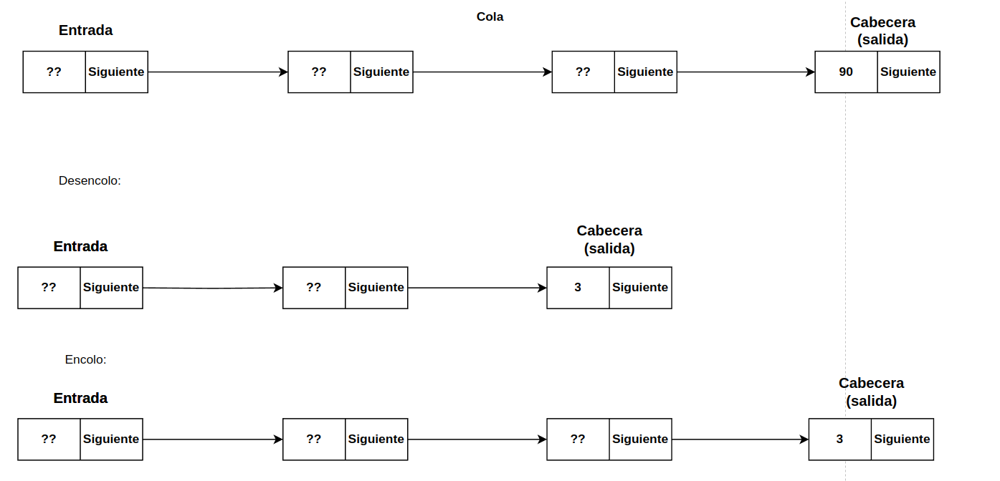

<div align="right">

</div>

# TDA LISTA/PILA/COLA

## Alumno: Puchetta Federico - 112853 - fpuchetta@fi.uba.ar

- Para compilar junto a main:

```bash
gcc -std=c99 -Wall -Wconversion -Wtype-limits -pedantic -Werror -O2 -g src/*.c ejemplo.c -o tdas
```

- Para compilar junto a pruebas de usuario:

```bash
gcc -std=c99 -Wall -Wconversion -Wtype-limits -pedantic -Werror -O2 -g src/*.c pruebas_alumno.c -o pruebas
```

- Para ejecutar:

```bash
./tdas
```

- Para ejecutar con valgrind:
```bash
valgrind --leak-check=full --track-origins=yes ./tp1 <archivo.csv> <operacion> [modo] [valor]
```
---
<div align="center">
  <h2><strong>Funcionamiento</strong></h2>
</div>

### Lista:
A la hora de desarrollar las estructuras del trabajo practico, opte por crear el TDA lista de la siguiente manera:

```c
typedef struct nodo {
	void *elemento;
	struct nodo *siguiente;
} nodo_t;

struct lista {
	nodo_t *principio;
	nodo_t *final;
	size_t cantidad_elementos;
};
```

De esta forma, como se ve en pantalla, decidi implementar el struct nodo_t el cual posee un void* que permite guardar cualquier tipo de dato a la vez que un llamado "recursivo" a otro nodo_t el cual seria el siguiente nodo. De esta forma, tenemos una estructura de nodo que nos permite realizar una lista simplemente enlazada, ya que un nodo **solo conoce su nodo siguiente**.

Luego, con esta implementacion ya definida de nodo_t a la hora de implementar la lista opte por tener 2 punteros a nodos esenciales, en un primer caso, el `puntero al nodo inicial` de la lista por el cual comienza a insertarse elementos y en un segundo caso el `puntero al nodo final` de la lista el cual mantiene siempre actualizado una referencia al ultimo nodo de la lista, es decir, el cual no tiene nodo siguiente. Por ultimo, se decide implementar el campo `cantidad_elementos` para poder tener un mejor manejo de la insercion de datos tanto como del tamanio de la lista.

### Pila y cola:

Al momento de desarrollar tanto el tda Pila como Cola, opte por la siguiente estructuracion:

```c
struct pila {
	lista_t *lista;
};

struct cola {
	lista_t *lista;
};
```

Opte por esta decision debido a que tanto una pila como una cola `son una lista con restricciones en su funcionamiento`. De esta forma, podemos pensar tanto a la pila como a la cola como una lista que simplemente tiene otras primitivas para ser utilizadas por el usuario, asi logramos reutilizar las funciones creadas para la lista y modularizamos el codigo.

### Lista iterador externo:

La estructura elegida para el iterador externo es la siguiente:

```c
struct lista_iterador {
	nodo_t *nodo_actual;
	bool seguir;
};
```

Opte por esta implementacion debido a que logra una correcta funcionalidad de reemplazo hacia la funcion for ordinaria permitiendo al usuario lograr iterador la lista sin conocer su implementacion, el campo `nodo_actual` nos ayuda a mantener siempre un puntero al nodo actual en el que iteramos hasta el momento, por ultimo, el campo `seguir` nos ayuda a tener un control de si debemos cortar la iteracion o todavia quedan elementos por recorrer.

---
## Explicacion y analisis de funciones

### Lista:

##### Funcion `lista_t *lista_crear()`:
```c
{
	lista_t *lista_creada = malloc(sizeof(lista_t));
	if (!lista_creada) {
		return NULL;
	}
	lista_creada->principio = NULL;
	lista_creada->final = NULL;
	lista_creada->cantidad_elementos = 0;
	return lista_creada;
}
```
Como su nombre indica, a la hora de comenzar a usar el TDA lista esta es la primer funcion que debe ser invocada por el usuario, la cual se encarga de alojar memoria para una lista en el heap e inicializar la misma vacia. A la hora de visualizar como quedaria la distribucion de memoria podemos denotar algo como lo siguiente:

<div align="center">

</div>

Debido a que la misma simplemente consta de `acciones constantes` podemos analizar la complejidad de esta funcion como multiples declaraciones o acciones constantes, dejando visto que su complejidad computacional es `O(1)`.

##### Funcion `bool lista_insertar(lista_t *lista, void *elemento)`:

```c
{
	if (!lista)
		return false;
	nodo_t *nodo_a_agregar = malloc(sizeof(nodo_t));
	if (nodo_a_agregar == NULL)
		return false;
	nodo_a_agregar->elemento = elemento;
	nodo_a_agregar->siguiente = NULL;
	if (lista->final == NULL) {
		lista->final = nodo_a_agregar;
		lista->principio = lista->final;
	} else {
		lista->final->siguiente = nodo_a_agregar;
		lista->final = nodo_a_agregar;
	}
	lista->cantidad_elementos += 1;
	return true;
}
```

Esta funcion inserta un elemento al final de la misma, es decir, en aquel nodo el cual si siguiente es NULL. De esta forma, se forman 2 posibles casos. Que la lista ya contenga elementos o que la lista este vacia.

En el primer caso, (lista con elementos) lo que se hace es utilizar el puntero al final de la lista para poder declarar que el siguiente del antiguo final, va a ser nuestro nuevo nodo a agregar, luego se actualiza el puntero al final para que apunte hacia nuestro nuevo nodo. Esto puede diagramarse de la siguiente forma:

<div align="center">

</div>

En el segundo caso, (lista vacia) lo que se hace es elegir uno de los dos punteros, principio o final, para hacer que apunte al nuevo nodo a agregar. Como ese nodo seria el unico que este en nuestra lista, luego se actualiza el otro puntero restante de la estructura para que apunte al mismo. Esto puede diagramarse de la siguiente forma:

<div align="center">

</div>

A la hora de analizar la complejidad de esta funcion vemos acciones constantes. Seguido a esto debemos ver el if y optar por el peor escenario posible para determinar cual analizar para nuestra complejidad:

```c
if (lista->final == NULL) {
		lista->final = nodo_a_agregar;
		lista->principio = lista->final;
	} else {
		lista->final->siguiente = nodo_a_agregar;
		lista->final = nodo_a_agregar;
	}
```

En este caso podemos denotar que ambos casos no son identicos pero denotan una complejidad constante, ya que al tener el puntero al final no debemos recorrer toda la lista para poder insertar un elemento al final en caso de que nuestra lista tenga `n` elementos. Finalmente podemos denotar que nuestra funcion posee complejidad computacional `O(1)`.

##### Funcion `bool lista_insertar_en_posicion(lista_t *lista, int posicion, void *elemento)`:

```c
{
	if (!lista || posicion < 0 ||
	    (posicion > lista->cantidad_elementos &&
	     lista->cantidad_elementos != 0))
		return false;
	if (posicion == lista->cantidad_elementos)
		return lista_insertar(lista, elemento);
	nodo_t *nodo_nuevo = malloc(sizeof(nodo_t));
	if (!nodo_nuevo)
		return false;
	nodo_nuevo->elemento = elemento;
	if (posicion == 0 && lista->cantidad_elementos == 0) {
		nodo_nuevo->siguiente = NULL;
		lista->principio = nodo_nuevo;
		lista->final = nodo_nuevo;
	} else if (posicion == 0) {
		nodo_nuevo->siguiente = lista->principio;
		lista->principio = nodo_nuevo;
	} else {
		nodo_t *anterior = iterar_hasta_posicion(lista, posicion - 1);
		nodo_nuevo->siguiente = anterior->siguiente;
		anterior->siguiente = nodo_nuevo;
		if (nodo_nuevo->siguiente == NULL)
			lista->final = nodo_nuevo;
	}
	lista->cantidad_elementos += 1;
	return true;
}
```

A diferencia de la funcion anterior, esta funcion tiene la posibilidad de insertar en cualquier posicion de la lista. De esta forma, se dan 3 posibles escenarios `insertar principio`, `insertar final` o `insertar cualquier otra posicion`. La funcion esta implementada de forma tal que en caso detener que insertar en el final de la misma se llame a **lista_insertar** la cual ya tiene la logica pertinente para insertar un elemento en el final de la lista. De cualquier otra manera, la funcion se encarga de evaluar si la insercion sera con una lista vacia o con elementos en caso de ser `la posicion inicial`, o si se trata de una insercion `distinta al final o inicio`.

Por un lado, en caso de tener que insertar al inicio con la lista vacia, el diagrama y la forma de actuar es el mismo caso que `lista_insertar` previamente explicado, por otro lado, en caso de tener que insertar al inicio en una lista con elementos primero proponemos que nuestro nodo nuevo apunte al siguiente del inicio y luego decimos que nuestro puntero al inicio apunte a nuestro nodo nuevo, similar a la insercion en el final.

El ultimo caso a ver es en el cual se pide insertar un elemento en una posicion `n` distinta de principio o final. En este caso, lo que se plantea es buscar la posicion anterior a la cual nos piden y guardar el nodo en esa posicion en una variable `anterior` y hacer que el siguiente del nodo nuevo apunte al nodo que se encuentra en la posicion que debemos insertar, es decir, el siguiente de nuestra variable `anterior`. Por ultimo hacemos que el nodo `anterior` apunte a nuestro nodo nuevo, quedando entre `el nodo anterior y el nodo en la posicion a insertar`, luego se evalua si el siguiente de nuestro nodo es null, lo cual significa que es el final de la lista y en dicho caso actualizamos nuestro puntero al final.

A la hora de analizar la complejidad de esta funcion, podemos separarlo en los 3 casos previamente mencionados, notando que, el peor de los escenarios es en el cual debemos insertar en una posicion arbitraria debido a que no tenemos ningun puntero para tener un acceso directo a dicha posicion.

Vemos que se llama a la funcion `iterar_hasta_posicion` la cual se encarga de recorrer nodo por nodo mediante su puntero al siguiente hasta encontrar la posicion pasada por parametro, de esta forma, en el peor de los casos esta funcion tendria una complejidad lineal de `O(n)` ya que seria el caso de recorrer todos los elementos hasta n-1. Podemos decir que lista_insertar_posicion tiene complejidad computacional `O(n)`.

##### Funcion `size_t lista_tamanio(lista_t *lista)`:

```c
{
	return (!lista) ? 0 : lista->cantidad_elementos;
}
```

Se encarga de acceder al campo del struct lista y devolver la cantidad de elementos correspondientes, posee una complejidad computacional constante `O(1)`.

##### Funcion `void *lista_obtener_elemento(lista_t *lista, int posicion)`:

```c
{
	if (!lista || posicion < 0 || posicion >= lista->cantidad_elementos)
		return NULL;
	nodo_t *actual = iterar_hasta_posicion(lista, posicion);
	return actual->elemento;
}
```

Esta funcion se encarga de iterar hasta la posicion pasada por parametro para luego devolver el puntero al elemento guardado en dicho nodo, en caso de que la posicion sea invalida devuelve NULL. Al utilizar nuevamente la funcion de `iterar_hasta_posicion` en el peor de los casos la funcion se ejecuta N veces, siendo N la cantidad de nodos o elementos, de esta forma decimos que la funcion tiene una complejidad de `O(n)`.

##### Funcion `void *lista_sacar_de_posicion(lista_t *lista, int posicion)`:

```c
{
	if (!lista)
		return NULL;
	nodo_t *nodo_anterior;
	nodo_t *aux;
	void *retorno;
	if (lista->cantidad_elementos == 0)
		return NULL;
	if (posicion == 0) {
		aux = lista->principio;
		lista->principio = aux->siguiente;
		if (lista->cantidad_elementos == 1)
			lista->final = NULL;
	} else {
		nodo_anterior = iterar_hasta_posicion(lista, posicion - 1);
		if (!nodo_anterior->siguiente)
			return NULL;

		aux = nodo_anterior->siguiente;

		nodo_anterior->siguiente = aux->siguiente;
		if (!nodo_anterior->siguiente)
			lista->final = nodo_anterior;
	}
	retorno = aux->elemento;
	free(aux);
	lista->cantidad_elementos -= 1;
	return retorno;
}
```
Como las funciones previamente analizadas, consta de dos casos, los cuales son una llamada a la funcion con una posicion accesible mediante los punteros del struct, o una llamada a la funcion con una posicion arbitratia. Aun llamando a la funcion con la ultima posicion, se debe iterar hasta dicho nodo, debido a que se busca el anterior. De esta forma, lo que hace la funcion es guardar en un auxiliar el nodo a eliminar para luego reconectar la lista del nodo anterior iterado con el siguiente del nodo a eliminar.

En el caso de eliminar un nodo de una posicion arbitraria puede representarse por los siguientes pasos:

<div align="center">


</div>

A la hora de analizar la complejidad de esta funcion, vemos que nuevamente en el peor de los escenarios del if, debemos iterar hasta n-1 elementos, y hacer acciones constantes con ellos, entonces podemos decir que la complejidad de la funcion es `O(n)`.

##### Funcion `int lista_buscar_posicion(lista_t *lista, void *elemento)`:
```c
{
	if (!lista)
		return -1;
	bool encontrado = false;
	nodo_t *actual = lista->principio;
	int posicion = 0;
	while (!encontrado && actual != NULL) {
		if (actual->elemento == elemento) {
			encontrado = true;
		} else {
			actual = actual->siguiente;
			posicion++;
		}
	}
	return (encontrado) ? posicion : -1;
}
```

Esta funcion busca iterar por la lista de `N` elementos hasta encontrar aquel nodo el cual tenga el mismo puntero al elemento pasado por parametro, es decir, se comparan punteros debido a que no hay una funcion de comparacion por parametro. De esta forma, en caso de haber iterado todos los elementos si se encontro se devuelve la posicion, en caso contrario se devuelve -1. En el peor de los casos, esta funcion iteraria toda la lista y nunca encontraria el mismo puntero por lo cual se haria  N veces el acceso a cada nodo y la comparacion del puntero al elemento, por lo cual, la complejidad de esta funcion es `O(n)`.

##### Funcion `void *lista_sacar_elemento(lista_t *lista, void *elemento)`:

```c
{
	if (!lista)
		return NULL;
	int posicion = lista_buscar_posicion(lista, elemento);
	if (posicion == -1)
		return NULL;
	void* retorno=lista_sacar_de_posicion(lista,posicion);
	return retorno;
}
```

Como el nombre indica, se encarga de sacar el nodo correspondiente al puntero del elemento pasado por parametro, es decir, nuevamente se comparan punteros. Es llamada con el elemento pasado como parametro para luego volver a aplicar la funcion `lista_sacar_de_posicion` con la posicion encontrada. De esta forma, como visualizamos previamente poseemos 3 casos de accion siendo el peor de todos el caso en el cual nos piden un elemento al final de la lista, de esta forma, al iterar `N` elementos 2 veces, la complejidad seria 2n y en notacion Big O, la funcion tiene complejidad computacional `O(n)`.

##### Funcion `void *lista_buscar(lista_t *lista, bool (*criterio)(void *, void *),void *contexto)`:

```c
	if (!lista || !criterio)
		return NULL;
	bool encontrado = false;
	nodo_t *actual = lista->principio;
	while (actual != NULL && !encontrado) {
		encontrado = criterio(actual->elemento, contexto);
		if (!encontrado)
			actual = actual->siguiente;
	}
	return (encontrado) ? actual->elemento : NULL;
```

En este caso, la funcion a analizar vemos que si tiene una funcion de comparacion en sus parametros `bool (*criterio)(void *, void *)` por la cual podemos comparar los elementos de la lista. Aun asi, en el peor de los casos la funcion nunca devolveria true hasta que se haya dejado de iterar la lista, logrando llamar a la funcion **N veces**, **siendo N la cantidad de elementos**.
Si buscamos analizar la complejidad de esta funcion, vemos que se llaman N veces la funcion de criterio, por lo cual la complejidad de `lista_buscar` esta si o si implicada por la de criterio. La funcion `criterio` tiene un tamanio del problema en base al elemento, pero como nuestra funcion de busqueda basa el tamanio del problema en el tamanio de la lista, el tamanio de cada elemento resulta insignificante, por lo cual la funcion resulta `O(n)`.

##### Funcion `int lista_iterar(lista_t *lista, bool (*f)(void *, void *), void *contexto)`:

```c
	if (!lista || !f)
		return 0;
	int iterados = 0;
	bool continuar = true;
	nodo_t *actual = lista->principio;
	while (actual != NULL && continuar) {
		continuar = f(actual->elemento, contexto);
		actual = actual->siguiente;
		iterados++;
	}
	return iterados;
```
Al igual que la funcion anterior, esta misma tambien se encarga de iterar la lista un maximo de N veces, haciendo en cada iteracion un llamado a la funcion `f` pasada por parametro, como mencionamos mas arriba: Si buscamos analizar la complejidad de esta funcion, vemos que se llaman N veces la funcion f, por lo cual la complejidad de `lista_iterar` esta si o si implicada por f. La funcion `criterio` tiene un tamanio del problema en base al elemento, pero como nuestra funcion de iteracion basa el tamanio del problema en el tamanio de la lista, el tamanio de cada elemento resulta insignificante, por lo cual la funcion resulta `O(n)`.

##### Funcion `void lista_destruir(lista_t *lista)`:
```c
{
	if (!lista)
		return;
	nodo_t *a_destruir = lista->principio;
	nodo_t *siguiente_a_destruir;
	while (a_destruir != NULL) {
		siguiente_a_destruir = a_destruir->siguiente;
		free(a_destruir);
		a_destruir = siguiente_a_destruir;
	}
	free(lista);
}
```

Esta funcion debe ser llamada una vez se termino de usar el TDA, la misma se encarga de liberar toda la memoria perteneciente a la lista exceptuando cada elemento, los cuales deberan ser liberados por el usuario. Por ultimo, se libera la memoria del puntero al struct en el heap.
A la hora de analizar la complejidad de esta funcion vemos nuevamente una iteracion por `N` nodos, mediante en el cual hacemos 1 accion constante por cada uno. Por lo tanto, la funcion encargada de destruir la lista tiene complejidad computacional `O(n)`.

### Lista iterador:

##### Analisis complejidad:

    A la hora de analizar la complejidad de todas las funciones del iterador, vemos que todas son de complejidad constante, debido a que la idea de implementar un iterador externo es que el usuario pueda iterar por cada elemento de la lista sin tener que iterar la lista intermediariamente para lograrlo. De esta forma, se logra una iteracion lineal.

### Pila:

##### Funcion `pila_t *pila_crear()`:

```c
{
	pila_t *p = malloc(sizeof(pila_t));
	if (!p)
		return NULL;
	p->lista = lista_crear();
	if (!p->lista) {
		free(p);
		return NULL;
	}

	return p;
}
```
Vemos que la funcion encargada de crear la pila hace lo mismo que la de crear la lista solo que esta misma guarda un puntero a un struct pila en memoria, la complejidad de la funcion se ve dada como constante debido a que simplemente se dan acciones de declaracion de variables como reserva de memoria.

##### Funcion `bool pila_apilar(pila_t *pila, void *elemento)`:

```c
{
	if (!pila)
		return false;
	bool insertado = lista_insertar_en_posicion(pila->lista, 0, elemento);
	return insertado;
}
```

La funcion vemos que se encarga de insertar un elemento en el tope de la pila, la cual utiliza la implementacion de insertar en posicion de lista tomando como posicion la cero, es decir, utiliza el puntero al inicio por lo cual podemos decir que `pila_apilar` es `O(1)`.

##### Funcion `void *pila_desapilar(pila_t *pila)`:
```c
{
	if (!pila || lista_tamanio(pila->lista) == 0)
		return NULL;
	void *sacado = lista_sacar_de_posicion(pila->lista, 0);
	return sacado;
}
```

Al igual que la funcion anterior, esta llama a la implementacion de `lista_tamanio` el cual devuelve el tamanio de la pila en este caso y a su vez utiliza la funcion `lista_sacar_de_posicion` con la posicion cero para nuevamente utilizar un llamado constante y respetar la restriccion del enunciado.

##### Funcion `bool pila_vacia(pila_t *pila)`:
```c
{
	if (!pila)
		return false;
	return (lista_tamanio(pila->lista) == 0);
}
```

Devuelve si la pila esta vacia utilizando la funcion lista_tamanio, la cual es de complejidad constante, por lo cual `pila_vacia` es `O(1)`.


##### Funcion `size_t pila_tamanio(pila_t *pila)`:
```c
{
	if (!pila)
		return 0;
	return lista_tamanio(pila->lista);
}
```

Devuelve el tamanio de la pila la cual corresponde al tamanio del campo lista, por lo cual utilizo `lista_tamanio` de complejidad constante.

##### Funcion `void *pila_tope(pila_t *pila)`:
```c
{
	if (!pila)
		return NULL;
	void *elemento = lista_obtener_elemento(pila->lista, 0);
	return elemento;
}
```

Devuelve el elemento que se encuentra en el `nodo tope` es decir, el unico elemento visible a la hora de trabajar con pilas, de esta forma la implemento utilizando `lista_obtener_elemento` con la posicion cero, logrando una complejidad constante debido a que utilizo el puntero al principio de la lista.

##### Funcion `void pila_destruir(pila_t *pila)`:
```c
{
	if (!pila)
		return;
	lista_destruir(pila->lista);
	free(pila);
}
```

Por ultimo, la funcion encargada de destruir la pila lo que hace es llamar a la funcion lista destruir la cual se encarga de destruir cada uno de los nodos como fue explicado previamente, de esta forma luego se libera la memoria reservada en el heap para el struct pila. Por lo explicado en `lista_destruir` la funcion tiene complejidad computacional `O(n)`.

### Cola:

##### Funcion `cola_t *cola_crear()`:
```c
{
	cola_t *c = malloc(sizeof(cola_t));
	if (!c)
		return NULL;
	c->lista = lista_crear();
	if (!c->lista) {
		free(c);
		return NULL;
	}

	return c;
}
```
Vemos que la funcion encargada de crear la cola hace lo mismo que la de crear la lista solo que esta misma guarda un puntero a un struct cola en memoria, la complejidad de la funcion se ve dada como constante debido a que simplemente se dan acciones de declaracion de variables como reservas de memoria.

##### Funcion `bool cola_encolar(cola_t *cola, void *elemento)`:
```c
{
	if (!cola)
		return false;
	bool insertado = lista_insertar(cola->lista, elemento);
	return insertado;
}
```

Esta funcion es la cual se encarga de insertar los elementos en la cola, la cual esta implementada mediante la funcion `lista_insertar` para no tener que reescribir codigo, ya que gracias a mi implementacion de lista puedo reutilizar los punteros de la misma al final para lograr que esta insercion sea constante en este caso en especifico. De esta forma se deduce que la funcion tiene complejidad computacional `O(n)`.

##### Funcion `void *cola_desencolar(cola_t *cola)`:
```c
{
	if (!cola)
		return NULL;
	void *sacado = lista_sacar_de_posicion(cola->lista, 0);
	return sacado;
}
```

La funcion de desencolar decidi aplicarla nuevamente utilizando la funcion `lista_sacar_de_posicion` con la posicion constante cero, de esta forma, se crea la idea de una cola la cual saca elementos de `un lado` y los inserta `del otro`, a su vez, de esta forma la funcion queda constante ya que a pesar de que nuestra funcion de sacar de posicion es `O(n)` en este caso en especifico siempre sera constante por lo cual la funcion `cola_desencolar` queda `O(1)`.

##### Funcion `bool cola_vacia(cola_t *cola)`:
```c
{
	if (!cola)
		return false;
	return (lista_tamanio(cola->lista) == 0);
}
```

La funcion `cola_vacia` como dice su nombre se encarga de decir si la cola tiene o no elementos, esto decidi implementarlo utilizando el campo `cantidad_elementos` de la lista con la funcion `lista_tamanio` de esta forma, se logra una funcion de **complejidad constante** ya que sin importar el tamanio de la lista siempre sera una accion constante.

##### Funcion `size_t cola_tamanio(cola_t *cola)`:
```c
{
	if (!cola)
		return 0;
	return (lista_tamanio(cola->lista));
}
```

Esta funcion se encarga de ver el tamanio de la cola otra vez implementando la funcion `lista_tamanio`, logrando nuevamente una **complejidad constante**.

##### Funcion `void *cola_frente(cola_t *cola)`:
```c
{
	if (!cola)
		return NULL;
	void *elemento = lista_obtener_elemento(cola->lista, 0);
	return elemento;
}
```

Esta funcion se encarga de ver lo que esta en la parte delantera de la cola, nuevamente, se reutiliza una funcion del TDA lista, en este caso, `lista_obtener_elemento` la cual en esta aplicacion posee **complejidad constante** debido a la implementacion de nuestra lista, accede al nodo que apunta el principio y devuelve el elemento.

##### Funcion `void cola_destruir(cola_t *cola)`:
```c
{
	if (!cola)
		return;
	lista_destruir(cola->lista);
	free(cola);
}
```

Esta funcion se encarga de liberar toda aquella memoria reservada durante el uso del TDA **cola**, la cual esta implementada mediante el uso de la funcion `lista_destruir` para destruir el puntero a la lista de nuestra estructura en memoria. Luego se libera la memoria reservada en el heap para nuestra cola, logrando en general una complejidad lineal `O(n)`.

---
## Respuestas teóricas
- Explicar qué es una lista, lista enlazada y lista doblemente enlazada.
  - Explicar las características de cada una.
  - Explicar las diferencias internas de implementación.
  - Explicar ventajas y desventajas de cada una, si existen.


Una lista es un TDA que se encarga de agrupar elementos en el cual cada uno de esos elementos posee un **predecesor** y un **sucesor**, exceptuando por el primero y el ultimo, debido a que el primero no tiene predecesor y el ultimo no tiene sucesor, una lista puede ser vacia o tener muchos elementos. En las listas podes insertar elementos en cualquier posicion o  eliminarlos.

Puede representarse por el siguiente dibujo:

<div>

</div>

Una **lista enlazada** es un tipo de **implementacion especifica** de una lista, la cual se realiza mediante la implementacion de nodos para la coleccion de elementos. Estos nodos son implementados con punteros a cada uno, los cuales se encargan de guardar su elemento y un puntero al siguiente nodo, manteniendo el orden previamente dicho. De esta forma podemos optar por tener un orden guardado sin necesidad de mantener un orden en la memoria, es decir, la memora no necesita estar contigua.

La estructura de un nodo puede pensarse de la siguiente forma:
```c
struct nodo{
	int elemento;
	struct nodo* siguiente_nodo;
};
```

La cual a la hora de implementarse en una lista enlazada representarse por el siguiente dibujo:

<div>

</div>

O el siguiente:

<div>

</div>

Ambas ilustraciones muestran correctamente una lista enlazada, el orden sigue siendo el mismo sin importar la contiguidad de los nodos.

Por ultimo, una **lista doblemente enlazada** es otra implementacion especifica del TDA lista, la cual utiliza otro tipo de nodos ya que no apuntan simplemente al siguiente, sino que tambien tienen un puntero al nodo anterior, de esta forma, este tipo de implementacion a su vez adquiere las caracteristicas de la lista enlazada y le suma la posiblidad de recorrerla en sentido contrario.

La estructura de un nodo puede pensarse de la siguiente forma:
```c
struct nodo{
	int elemento;
	struct nodo* siguiente_nodo;
	struct nodo* anterior_nodo;
};
```

Se puede representar por el siguiente dibujo:

<div>

</div>

Las diferencias entre estas dos implementaciones no son demasiado notorias en funcionalidad, pero sí en aspectos de memoria y recorrido.

En tema de espacio, la **doblemente enlazada** debe guardar dos punteros por nodo (anterior y siguiente) lo cual requiere mas espacio en memoria que una simplemente enlazada la cual guarda un unico puntero,Sin embargo, esta característica le permite recorrer la lista en ambos sentidos (adelante y atrás), lo cual puede ser ventajoso para ciertas operaciones (como eliminar sin necesidad de conocer el nodo anterior).

Ambas dos no necesitan de memoria contigua para ser utilizadas, es decir que cada elemento puede encontrarse libremente en cualquier lugar de la memoria y la lista funcionaria correctamente siempre y cuando el nodo contenga el puntero correcto tanto siguiente como anterior.

Aun asi, la descontinuacion de la memoria es la que genera una complejidad mas elevada a la hora de un acceso arbitrario, ya que al no estar contigua no podemos hacer un acceso aleatorio a cualquier elemento de la misma (como en un array), es decir, debemos recorrer nodo por nodo para llegar al elemento buscado, se habla de **acceso secuencial**.

---

- Explicar qué es una lista circular y de qué maneras se puede implementar.

Una lista circular es a su vez otro tipo de implementacion de lista.

La diferencia con las listas ordinarias es que una circular, su ultimo elemento no apunta a null, sino que vuelve a apuntar al nodo del principio, formando esta conexion con el primer elemento desde el ultimo.

Como cualquier lista, una lista circular puede implementarse **con enlace simple o enlace doble** es decir, existen **listas circulares doblemente enlazadas** y **listas circulares simplemente enlazadas**.

Las listas circulares simplemente enlazadas permiten acceder al primer elemento a partir del ultimo, mientra que las doblemente enlazadas permiten acceder tambien de forma contraria, es decir del primero al ultimo.

	A pesar de la implementacion circular, el largo de la lista sigue siendo el mismo que si fuera no circular

El diagrama de una lista circular en ambos casos puede verse de la siguiente forma:

<div>

</div>

---

- Explicar la diferencia de funcionamiento entre cola y pila.


Ambos TDA se pueden pensar como una lista con restricciones de uso, una pila respeta la regla **LIFO** (Last In First Out), es decir, los elementos que ingresan a la pila salen y entran por el mismo lado, y solo tenemos acceso al elemento en el `TOPE`, mientras que el resto estan ocultos. Solo se puede insertar y sacar por el tope.

Si pensamos a la pila como una lista al reves podemos verlo asi:

<div>

</div>

Luego, una cola es otro TDA el cual sigue la regla **FIFO** (First In First Out), es decir, el primer elemento que entra es a su vez el primero que sale ya que estos elementos ingresan por un lado y salen por el otro, aun asi se asemejan en que solo conocemos la cabecera de la cola.

Si pensamos a la cola como una litsa podemos verlo asi:

<div>

</div>

---

- Explicar la diferencia entre un iterador interno y uno externo.

Un iterador interno es aquel el cual mantiene su logica de iteracion fuera de la vista del usuario y viene diseniado en la implementacion del propio TDA, sirve para recorrer la lista sin tener control de como lo hace mas que una simple condicion de corte final. 

Por otro lado, un iterador externo es aquel designado para lograr iterar un TDA de una manera mas controlada sin conocer la implementacion de este mismo TDA, para esto, se le pasa la informacion a otro nuevo tipo de dato abstracto el cual si conoce la implementacion y nos permite un mejor acceso a la logica de iteracion logrando tener mas manejo de los datos del mismo.